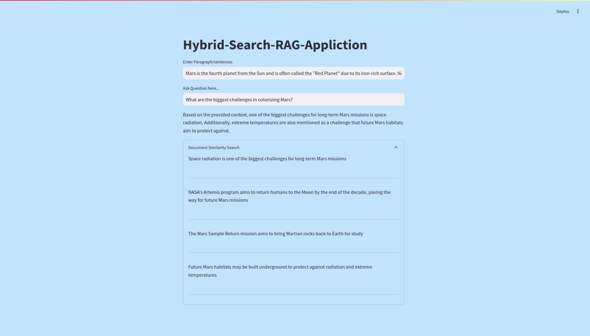
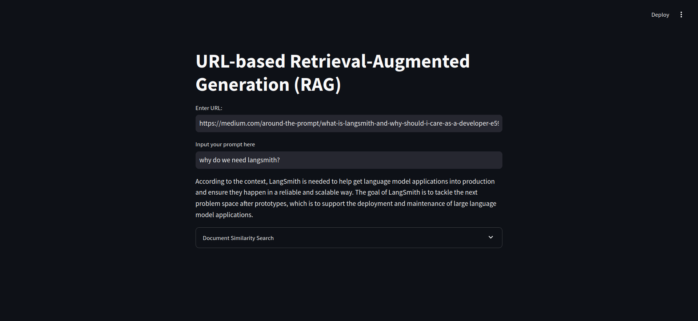
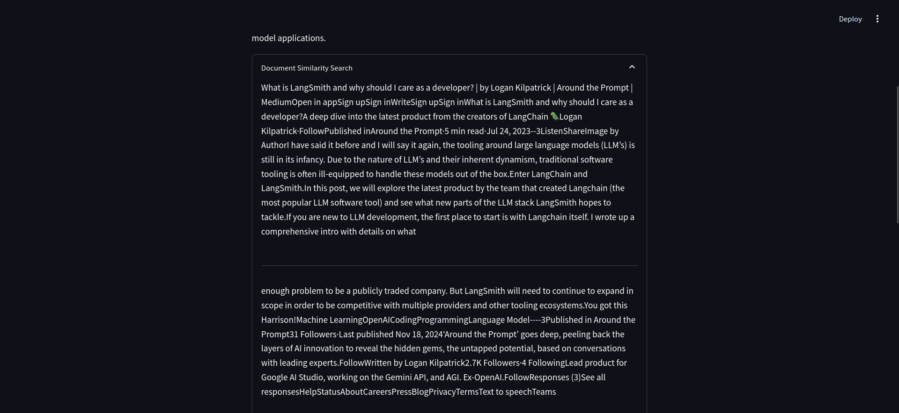

# Various RAG Application Implementations.

## 1. Hybrid-Search RAG using Pinecone and LLAMA 3



This project implements a Hybrid-Search RAG system using Pinecone, Langchain, and LLAMA 3. It utilizes a combination of **dense vector search and sparse keyword search (BM25)** to improve retrieval accuracy, ensuring that the most relevant documents are retrieved for better text generation.

### LLAMA 3

LLAMA 3 is a powerful large language model designed to perform text generation, retrieval-augmented generation, and other NLP tasks efficiently. This project utilizes **LLAMA 3 via Groq API** to generate high-quality responses.

### Pinecone

Pinecone is a high-performance vector database that enables fast similarity searches on embeddings. This project uses **hybrid search**—a combination of **dense (vector) search and sparse (BM25) search**—to enhance retrieval quality.

### Ollama Embeddings

Ollama embeddings with `model=llama2 7B` are used to generate vector representations of documents, ensuring an efficient and accurate retrieval process.

### Project Details

#### Document Used for RAG

The document used in this project for retrieval-augmented generation is:

```
Research Papers on AI Governance and Ethical AI
```

#### Model Used

The LLAMA model used in this project is:

```
LLAMA 3 via Groq API
```

#### How It Works

```
    Document Storage: The document is stored in Pinecone using both dense (embeddings) and sparse (BM25) representations.
    Query Processing: The hybrid search mechanism retrieves relevant parts of the document using both vector and keyword-based search.
    Text Generation: The retrieved information is passed to LLAMA 3 via Langchain, which generates a response based on the query and retrieved document fragments.
    Output: The generated text is provided as the final response to the query.
```

---

## 2. URL-Based RAG using BeautifulSoup, Langchain, and LLAMA 3




This project implements a **web-based RAG** system that dynamically retrieves content from URLs, processes the extracted text, and generates responses using LLAMA 3.

### LLAMA 3

LLAMA 3 is utilized for text generation and question answering based on retrieved web content. This project integrates **LLAMA 3 via Groq API** to ensure high-quality responses.

### Web Scraping with BeautifulSoup

To retrieve content from websites, this project uses **BeautifulSoup** via Langchain’s `WebBaseLoader`, allowing real-time document retrieval from URLs.

### Ollama Embeddings

Ollama embeddings with `model=llama2 7B` are used to generate vector representations of the extracted text, ensuring efficient search and retrieval.

### Project Details

#### Data Source for RAG

This RAG system processes content from dynamic web pages. Example website used for retrieval:

```
https://medium.com/around-the-prompt/what-is-langsmith-and-why-should-i-care-as-a-developer-e5921deb54b5"

```

#### Model Used

The LLAMA model used in this project is:

```
LLAMA 3 via Groq API
```

#### How It Works

```
    Web Scraping: The WebBaseLoader module fetches text from the provided URLs using BeautifulSoup.
    Document Storage: The extracted content is stored as embeddings using Ollama.
    Query Processing: When a query is received, the relevant web content is retrieved.
    Text Generation: The retrieved content is passed to LLAMA 3 via Langchain, which generates a response.
    Output: The generated response is returned to the user.
```

---


## 3.RAG with LLAMA 2.0, Langchain, and ChromaDB

This project implements a Retrieval-Augmented Generation (RAG) system using LLAMA 2.0, Langchain, and ChromaDB. The system processes a document and generates text based on queries by leveraging both retrieval and generation techniques.

### LLAMA 2.0

LLAMA 2.0 is a state-of-the-art language model developed by Facebook AI Research (FAIR). It is designed to perform a variety of natural language processing tasks, including text generation, classification, and question answering. In this project, we use the 7B parameter variant of LLAMA 2.0 to generate high-quality text based on retrieved documents.
Langchain

Langchain is a framework that provides tools for building applications that use large language models (LLMs). It simplifies the integration of LLMs into various applications by providing utilities for managing models, handling inputs and outputs, and optimizing performance. Langchain helps streamline the process of developing and deploying language model-based applications.

### ChromaDB

ChromaDB is a highly efficient and scalable database designed for storing and querying large collections of documents. It supports advanced retrieval mechanisms that allow for fast and accurate document retrieval based on various criteria. In this project, ChromaDB is used to store the document and enable efficient retrieval of relevant information.
Project Details
Document Used for RAG

The document used in this project for retrieval-augmented generation is:

    Preliminary Agreement Chips and Science Act Award

Model Used

The LLAMA model used in this project is:

    LLAMA 2.0 7B-Chat HF

How It Works
```
    Document Storage: The document is stored in ChromaDB for efficient retrieval.
    Query Processing: When a query is received, ChromaDB retrieves relevant parts of the document.
    Text Generation: The retrieved information is passed to LLAMA 2.0 via Langchain, which generates a response based on the query and retrieved document fragments.
    Output: The generated text is provided as the final response to the query.
```
## Summary

This project consists of three different RAG implementations:

1. **Hybrid-Search RAG with Pinecone** (LLAMA 3, hybrid retrieval: vector + sparse BM25)
2. **URL-Based RAG using Web Scraping** (LLAMA 3, real-time web retrieval with BeautifulSoup)
3. **ChromaDB-based RAG** (LLAMA 2.0, document-based retrieval)

Each implementation is optimized for different retrieval techniques, ensuring robust and efficient response generation.